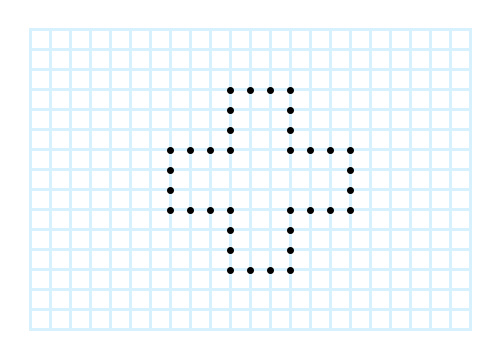
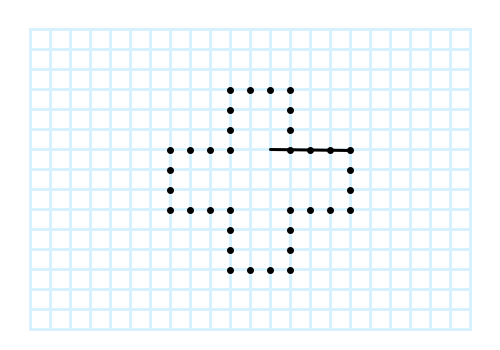
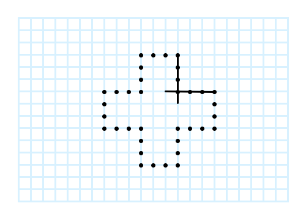
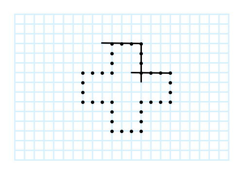
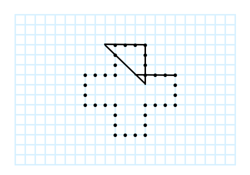

# 4+1 patience game resolver

I've never learned a name more proper than "line patience" or "line solitaire"
(viivapasianssi) for this game an aunt of mine taught me as one she had been
playing while attending university lectures.

The game is played on a grid – squared paper. It is initialized by marking a
set of intersections of the grid as "filled" in the shape of a plus as shown
in Figure 1.
(This is why I have the + character in the name given here.)

|  |
|:--:|
| *Figure 1. The initial plus.* |

Upon this shape one may draw horizontal, vertical or diagonal lines, spanning
five intersections such that (at least) four of them are "filled" and one
is empty. (Thus "4 + 1".) One possibility of a starting line is shown in
Figure 2.

|  |
|:--:|
| *Figure 2. One possible first line drawn.* |

The lines may cross each other, as shown in Figures 3 and 4, but the lines
may not overlap.

|  |
|:--:|
| *Figure 3. Continuing with a vertical line.* |

|  |
|:--:|
| *Figure 4. Another horizontal line.* |

The drawn lines make their "empty" intersection becomes now "filled" as well.
Playing the game onwards, these "filled" intersections are used like the ones
in the initial plus, as shown in Figure 5.

|  |
|:--:|
| *Figure 4. A diagonal line using three newly filled intersections and one originally filled intersection.* |

I believe this game is not to be open-ended, but rather, as the built shape grows
in area, the new filled intersections become too far away from each other to
build anything sustainable. However, I haven't proved this, so I'm now
trying to go through all the possible iterations of the game.

# Running the game

You need to have the pygame package installed.

Run the game with command pythonw resolve.py

# The initial plus shape

|    | -5 | -4 | -3 | -2 | -1 |  0 |  1 |  2 |  3 |  4 |  5 |  6 |
| -1 |    |    |    |    |    |    |    |    |    |    |    |    |
|  0 |    |    |    |    |  X |  X |  X |  X |    |    |    |    |
|  1 |    |    |    |    |  X |    |    |  X |    |    |    |    |
|  2 |    |    |    |    |  X |    |    |  X |    |    |    |    |
|  3 |    |  X |  X |  X |  X |    |    |  X |  X |  X |  X |    |
|  4 |    |  X |    |    |    |    |    |    |    |    |  X |    |
|  5 |    |  X |    |    |    |    |    |    |    |    |  X |    |
|  6 |    |  X |  X |  X |  X |    |    |  X |  X |  X |  X |    |
|  7 |    |    |    |    |  X |    |    |  X |    |    |    |    |
|  8 |    |    |    |    |  X |    |    |  X |    |    |    |    |
|  9 |    |    |    |    |  X |  X |  X |  X |    |    |    |    |
| 10 |    |    |    |    |    |    |    |    |    |    |    |    |

